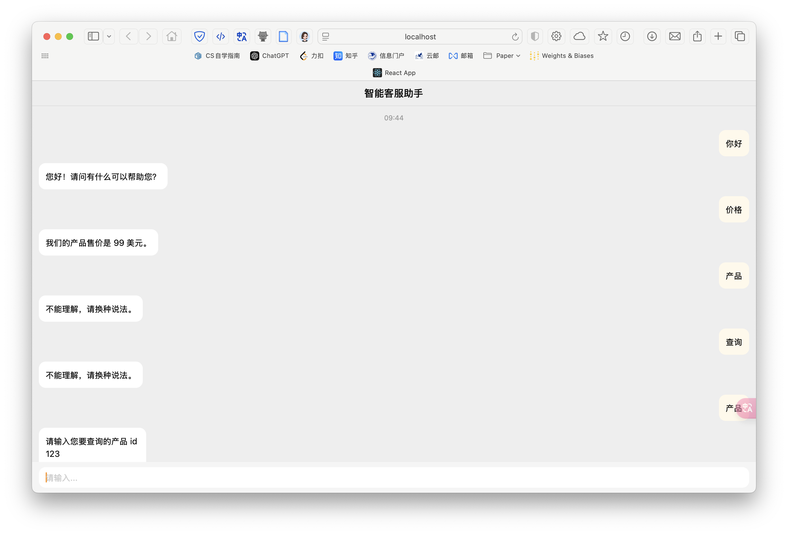
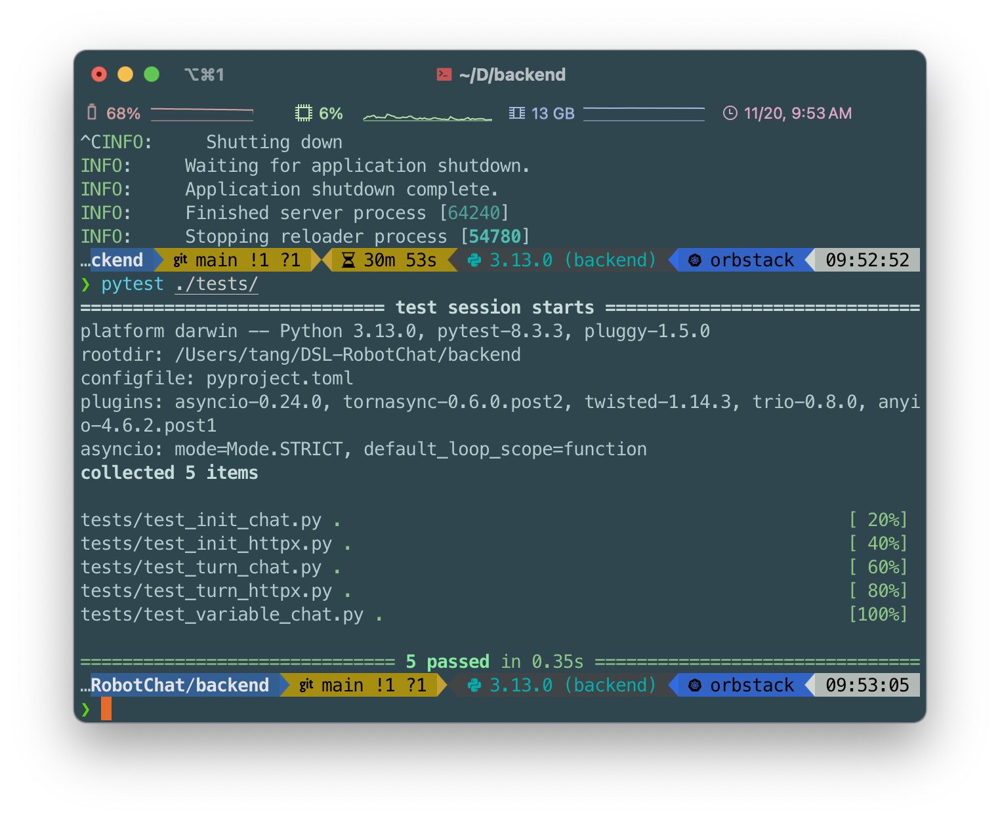

# DSL-RobotChat

> 设计 DSL 语言的语法定义参考 [backend/README.md](https://github.com/Word2VecT/DSL-RobotChat/blob/main/backend/README.md)

## 技术栈

- 前端: [`React`](https://github.com/facebook/react)
- 后端: [`FastAPI`](https://github.com/fastapi/fastapi)
- 语法分析: [`Lark`](https://github.com/lark-parser/lark)
- UI 组件库: [`ChatUI`](https://github.com/alibaba/ChatUI)
- 项目管理: `Git`
- Python 项目管理: [`uv`](https://github.com/astral-sh/uv)
- 测试框架： `pytest`

## 快速开始

1. 克隆本项目到本地

    ```git
    git clone https://github.com/Word2VecT/DSL-RobotChat.git
    ```

2. 进入项目后端文件夹

    ```bash
    cd DSL-RobotChat
    cd backend
    ```

3. 安装 `uv` Python 项目管理器

    ```bash
    pip install uv
    ```

4. 使用 `uv` 安装虚拟环境

    ```bash
    uv venv
    ```

5. 根据提示,激活虚拟环境 (以 `fish` 为例)

    ```bash
    source .venv/bin/activate.fish
    ```

6. 安装项目依赖

    ```bash
    uv pip install -r pyproject.toml
    ```

7. 后端服务测试

    ```bash
    pytest ./tests/
    ```

8. 运行后端服务

    ```bash
    uvicorn main:app --reload
    ```

9. 新建命令行窗口，进入后端文件夹

    ```bash
    cd DSL-RobotChat
    cd frontend
    ```

10. 安装前端依赖

    ```bash
    npm install
    ```

11. 运行前端服务

    ```bash
    npm start
    ```

## 运行与测试效果





## 项目描述

本项目实现了一个领域特定语言（Domain Specific Language, DSL），用于描述在线客服机器人的自动应答逻辑。通过本项目，用户可以通过自定义脚本语言轻松设计客服机器人的业务逻辑。该技术适用于银行、通信、商务等复杂信息系统中的自动化客户服务。

本项目的主要功能包括：

- 自定义领域特定脚本语言，满足描述客服机器人自动应答逻辑的需求。
- 设计并实现脚本解释器，根据用户输入执行脚本逻辑。
- 提供多个脚本示例，不同脚本可展现不同的行为逻辑。

---

## 功能要求

1. **脚本语言设计**：脚本语法可以自由定义，只需满足描述客服机器人自动应答逻辑的需求。
2. **灵活的输入输出格式**：支持简化为命令行交互。
3. **示例脚本**：提供多种脚本示例，用于展示脚本解释器在不同脚本条件下的执行效果。

---

## 项目评分标准

项目总分为 **100 分**，评分细则如下：

### 风格 (15 分)

- 代码注释：6 分
- 变量命名：6 分
- 其他：3 分

### 设计和实现 (30 分)

- 数据结构设计：7 分
- 模块划分：7 分
- 功能实现：8 分
- 文档完整性：8 分

### 接口 (15 分)

- 程序间接口：8 分
- 人机交互界面：7 分

### 测试 (30 分)

- 测试框架设计：15 分
- 自动化测试脚本：15 分

### 记法 (10 分)

- 脚本语言语法描述：10 分

> 注意：抄袭或意图抄袭行为将被判为 0 分。
